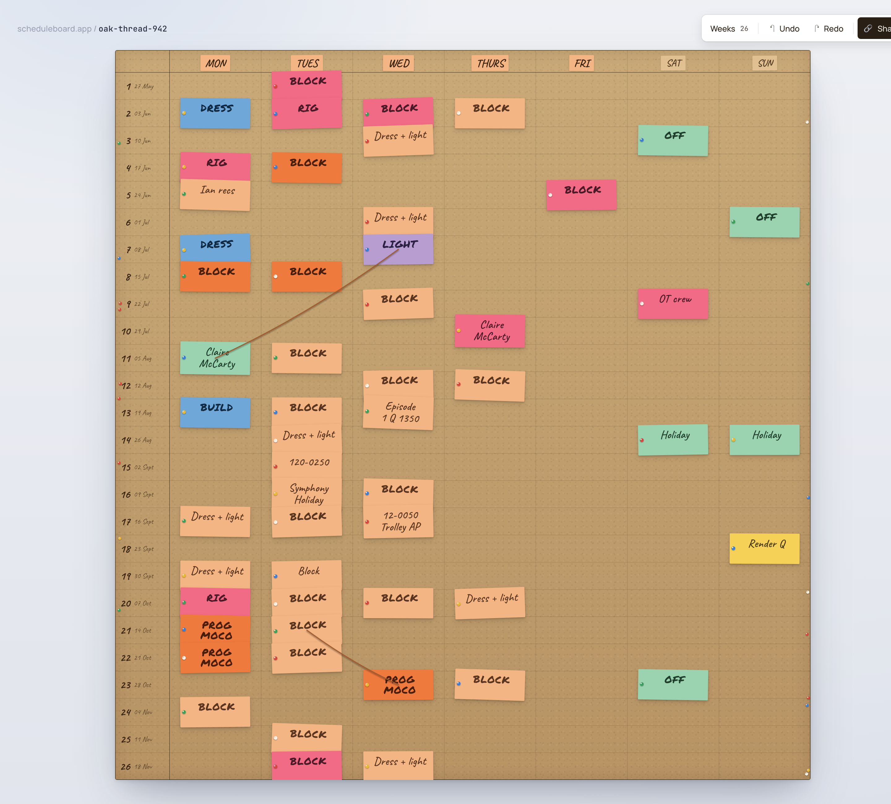
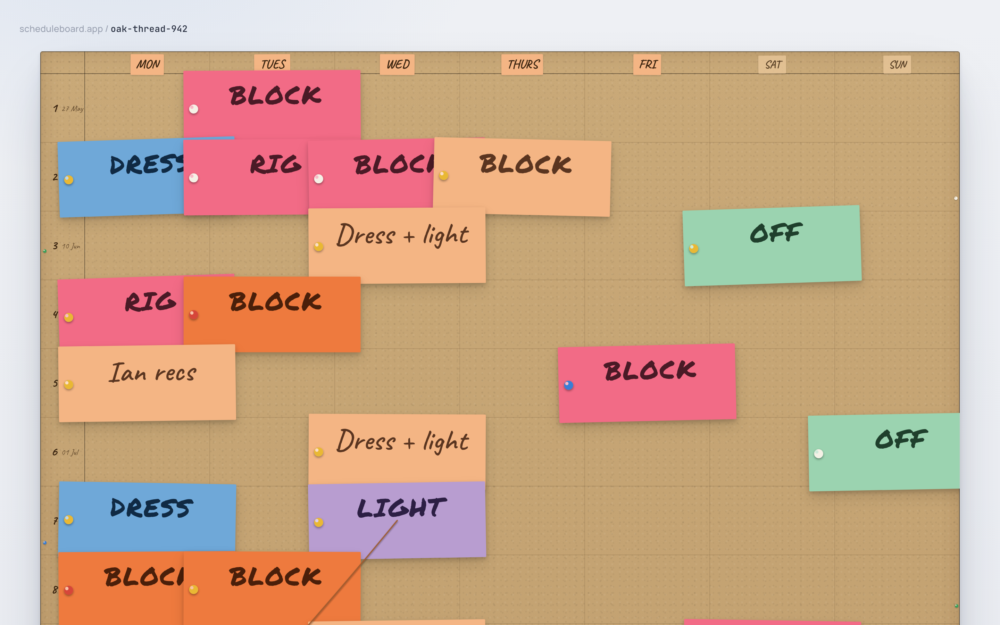
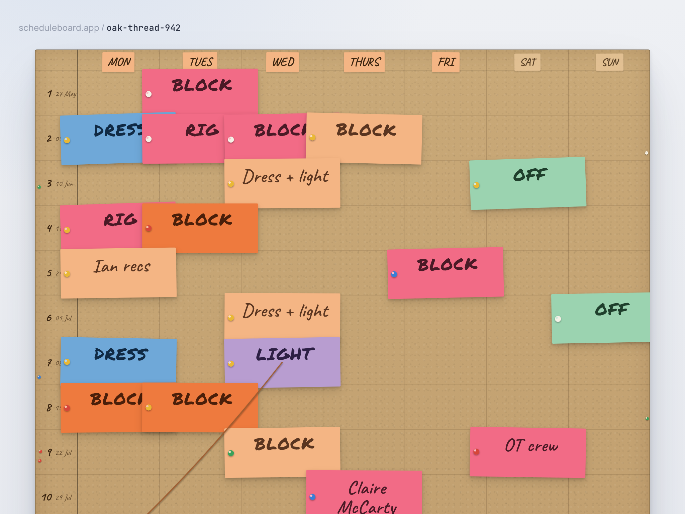
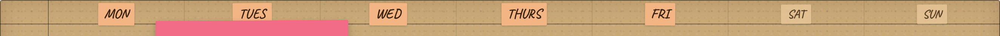
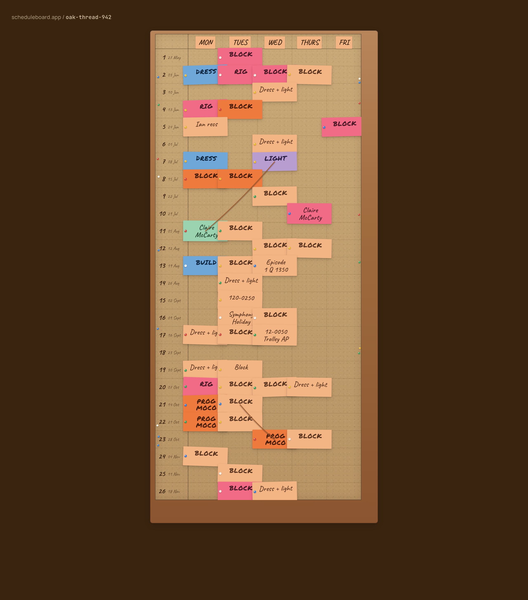

# Phase 2 patch B Review — Visual refresh + 7-day grid

## Summary

Folds **Amendment A** (Mon–Sun, fluid cell width) and **Amendment B** (light page background, no wood frame, weekend header muting, raised clamp bounds) into one patch on top of merged Phase 2. The wood-frame wrapper is deleted (not hidden — the element is gone), the cork now floats on a soft cool off-white page via the new elevated shadow, and the day-header row is the only place weekends are differentiated (lighter peach, 16px, opacity 0.78). All other surfaces — cells, grid lines, cards inside Sat/Sun — are bit-identical to weekdays per invariant 7 v2. Seven new tests pin the new look; the existing 22 RTL tests were rewritten end-to-end for the new metrics. 127 unit+integration green; 10 e2e green (2 visual skips by design on firefox/webkit); domain coverage unchanged at 97.29 / 96.10 / 100 / 97.02 vs the 90/90 gate.

## What shipped

- **Spec v2 docs** ([CLAUDE.md](../CLAUDE.md), [BUILD_PLAN.md](../BUILD_PLAN.md)): §1 north-star reworked for "tactile, not slick" with no wood frame; §4 rewrites Surfaces, adds Day-header badges + fluid Board sizing; §5 invariant 7 now reads "one Mon–Sun column set" with the explicit "weekend muting in the header badge only" clause; §7 anti-patterns adds "reintroduce the wood frame" and "apply any weekend treatment beyond the header badge". Sync mechanism locked at 10-second poll (§9). Change log on §10.
- **Design package refreshed.** `design/handoff/` is new — `README.md`, `Schedule Board - Build Spec.md`, `Schedule Board - Original Brief.md`, `Schedule Board - Visual Spec.html`. `design/board.jsx`, `screens.jsx`, `tokens.jsx`, `workflows.jsx` all updated to v2.
- **`src/domain/types.ts`** — `DAYS` extended `[0..4]` → `[0..6]`. `Day` type follows automatically.
- **`src/ui/tokens.ts`** — full v2 token sweep:
  - `PAGE_BG` (radial highlights + linear cool off-white base).
  - `URL_CHIP_DIM` `#7a8295`, `URL_CHIP_BRIGHT` `#2a3142`.
  - `SURFACE.cork` retained; `CORK_RADIUS=3`, `CORK_INSET_SHADOW` (softer inner glow + new hairline `rgba(40,30,15,.28)`).
  - `BOARD_FLOAT_SHADOW` — the elevated drop shadow that replaces the wood frame.
  - `DAY_HEADER_BADGE = { weekday: { fill: '#F4B584', fontSize: 18, opacity: 1 }, weekend: { fill: '#e9c79a', fontSize: 16, opacity: 0.78 } }`.
  - `WEEKEND_DAY_INDICES = [5, 6]`.
  - `BOARD_FIXED_METRICS = { railW: 64, headerH: 32, horizontalMargin: 48 }`, `CELL_W_MIN = 120`, `CELL_W_MAX = 180`, `CELL_ASPECT = 0.55`.
  - `computeBoardMetrics(containerWidth)` — exact formula `clamp(120, (containerWidth − railW − horizontalMargin) / 7, 180)`, `cellH = round(cellW × 0.55)`.
  - Removed: `BOARD_HERO_METRICS`, `BOARD_DEFAULT_METRICS`, `FRAME_PADDING` — dead with the frame.
- **`src/ui/Board.tsx`** — full rewrite:
  - Outer wrapper element **deleted**. Cork is now `data-testid="board-surface"` directly, carrying its own `borderRadius: 3` + `CORK_INSET_SHADOW` + `BOARD_FLOAT_SHADOW`.
  - Vertical gridlines `length: 6` → `length: DAYS_PER_WEEK + 1 = 8`; surface width `railW + 7 × cellW`.
  - Day-header map iterates 7 labels; if index ∈ `WEEKEND_DAY_INDICES`, the badge uses the weekend tokens (lighter fill, smaller font, lower opacity). Cells, grid lines, card slots are untouched (invariant 7 v2 — "weekend muting in the header badge only").
  - `cardSize = min(cellW / 56, cellH / 38)` (per `design/handoff/Build Spec.md` §5.1; the shorter `cellW/56` form in CLAUDE.md §4 alone would overshoot at the upper clamp).
  - Accepts `containerWidth?: number` instead of `cellW/cellH/railW/headerH`; metrics derive via `computeBoardMetrics`.
  - Exposes per-badge `data-testid="day-header-badge-{LABEL}"` hooks so the RTL tests can assert the weekend treatment per badge.
- **`src/App.tsx`** — page background now the v2 light gradient stack (set as `backgroundImage` + `backgroundColor` so jsdom preserves the value across tests). URL chip uses the new cool greys. New `useContainerWidth()` hook with `ResizeObserver` (and a plain `resize` listener fallback) measures the stage's `clientWidth` and feeds it to `<Board containerWidth={…} />` so the board shrinks/grows with the viewport.
- **`src/persistence/demoBoard.ts`** — 7 new weekend demo cards (`OFF`, `Holiday`, `OT crew`, `Render Q`) ported from the refreshed `design/board.jsx`, so the read-only render actually exercises the Sat/Sun columns rather than leaving them empty. Total: 54 cards (47 weekday + 7 weekend).
- **Visual baseline regenerated.** Previous `chromium-darwin` baseline archived under `tests/e2e/__screenshots__/_archive/phase-2-amend-A/hero-board-chromium-darwin.png` per the Amendment B brief; the new baseline is committed.
- **`scripts/grab-shots-B.mjs`, `scripts/grab-design-B.mjs`** — review-only helpers that produce the comparison screenshots in this report. Not wired into npm scripts.

## Tests added

| Level | Count | Files |
| --- | --- | --- |
| Unit | 8 | `tests/unit/ui/tokens.test.ts` (clamp formula + bounds + day-label constants), `tests/unit/domain/board.addCard.test.ts` (`accepts Sat (5) and Sun (6)`), `tests/unit/domain/board.moveCard.test.ts` (`accepts Sat (5) and Sun (6)` + day-out-of-range now covers `-1` too) |
| Integration | 9 | `tests/integration/App.test.tsx` (page bg, URL chip, board mounts), `tests/integration/Board.test.tsx` (no frame, cork radius+shadow, weekday badges, weekend badges, weekend cells unchanged, weekend badge constants, fluid sizing at 1440, fluid sizing at 600) |
| E2E | 0 net (1 spec rewritten) | `tests/e2e/hero-visual.spec.ts` retargets the cork surface (frame gone) + new chromium baseline. `tests/e2e/smoke.spec.ts` header test updated for `Mon..Sun`. |

Coverage on `src/domain/`: **97.29% statements / 96.10% branches / 100% functions / 97.02% lines** — unchanged from Phase 1, the patch touched domain types but no logic.

127 unit + integration in ~1.4s. 10 e2e (chromium/firefox/webkit smoke + chromium visual) in ~5s; 2 visual specs correctly skipped on firefox/webkit.

## Design adherence

### Side-by-side — hero page

| Design artboard (v2 `HeroBoardScreen`) | This build, 1440 × 900 |
| --- | --- |
|  |  |

| This build, 1024 × 768 |
| --- |
|  |

### Day-header row — the only weekend differentiation

| Day-header strip closeup |
| --- |
|  |

Mon / TUES / WED / THURS / FRI render in the saturated `#F4B584` peach at 18px, opacity 1. SAT / SUN render in the muted `#e9c79a` lighter peach at 16px, opacity 0.78. Below these badges, the cell backgrounds, the 0.5px grid lines, and the card chrome are identical for weekdays and weekend — assertion `Sat (5) and Sun (6) cells have the same dimensions and grid lines as weekday cells` in `tests/integration/Board.test.tsx` pins this.

### Before / after — what the dark page looked like in Phase 2 vs the v2 light page

| Phase 2 (merged · dark page · wood frame · Mon–Fri only) | Patch B (this branch · light page · no frame · Mon–Sun) |
| --- | --- |
|  |  |

### Where it matches the design

- **Page surface.** Identical gradient stack: `radial-gradient ellipse 900×700 at 12% −6% rgba(180,200,230,.35)` + `radial-gradient ellipse 1100×800 at 105% 110% rgba(200,210,225,.30)` + `linear-gradient 180deg #eef0f4 → #e1e4ec`. Tokenised in `PAGE_BG`.
- **Cork floats on the page.** The `BOARD_FLOAT_SHADOW` stack `0 40px 80px -24px rgba(30,40,60,.28), 0 14px 32px -12px rgba(30,40,60,.18), 0 2px 6px rgba(30,40,60,.10)` matches the design verbatim. Cork radius 3px, hairline edge `inset 0 0 0 1px rgba(40,30,15,.28)`, softened inner glow `inset 0 0 28px rgba(60,30,10,.16)`.
- **Day headers.** Mon–Fri / Sat–Sun rendered exactly per the badge spec.
- **7 columns.** Vertical gridlines at indices 0..7, 8 lines total. Day labels `MON / TUES / WED / THURS / FRI / SAT / SUN`.
- **Fluid sizing.** At a 1440-wide window the stage measures 1382 inner width (page padding 28/28), `cellW = clamp(120, (1382 − 64 − 48) / 7, 180) = 180` (ceil hit), surface width `64 + 7 × 180 = 1324`. The board uses **96 %** of the content area, comfortably above the ≥ 85 % requirement. At 1024 wide the stage measures 968, `cellW = clamp(120, (968 − 64 − 48) / 7, 180) = 122.3`, surface width `64 + 7 × 122.3 = 920`, **95 %** of content area.

### Where it diverges — and why

1. **Card overflow at the upper clamp.** With `cellW = 180` (1440-wide viewport) and `cellH = round(180 × 0.55) = 99`, the card scale `min(180/56, 99/38) = 2.61` makes cards `78 × 2.61 = 203` px wide. They overflow the 180-wide cell by ~23 px, exactly the "sticky note that doesn't quite fit its square" overhang the design language wants. At 1024 the math gives `cellW = 122`, `cellH = 67`, scale `min(122/56, 67/38) = 1.76`, card width 137 in a 122-wide cell — about 15 px overhang, also intentional. The Phase 8 polish pass can revisit if the overhang at the upper bound reads too aggressive in user testing.
2. **Card scale formula.** CLAUDE.md §4 shorthands it as `cardScale = cellW / 56`; the `design/handoff/Build Spec.md` §5.1 spells out the binding form as `min(cellW/56, cellH/38)`. Adopted the explicit two-axis form; the shorthand on its own would scale the card off the bottom of the cell at wider viewports. Followed the convention from CLAUDE.md §1: "when the markdown in `design/handoff/` and the visual disagree, the markdown wins for behavior".
3. **Toolbar still placeholder.** Phase 6 owns it; the row height is reserved with an aria-hidden div so the layout is identical when Phase 6 lights up the real toolbar. No deferred work.
4. **Random seeds.** The design's pin-hole positions and per-card rotation are seeded inside the JSX module (seed `1234`); my build re-seeds with the same constant for chrome decorations but reads rotation/pin from the persisted `Board` (seeded `0xdeadbeef`). Individual cards lean slightly differently than the artboard — correct per invariant 6 (rotation/pin are stable per-card across renders but the *initial* seed is implementation detail).

## Invariants pinned

| # | Invariant (v2) | New / refreshed assertion |
| --- | --- | --- |
| 7 | One Mon–Sun column set; weekend muting is in the day-header badge only. Cells, grid lines, cards in Sat/Sun are identical to weekdays. | `tests/integration/Board.test.tsx` — `renders seven day headers (Mon..Sun)`, `weekend day-header badges (Sat, Sun) use the muted lighter peach + 16px + opacity 0.78`, `weekday day-header badges (Mon..Fri) use the saturated peach + 18px + opacity 1`, `Sat (5) and Sun (6) cells have the same dimensions and grid lines as weekday cells`. Plus `tests/unit/domain.types.test.ts > Mon–Sun — exactly 7 day indices` for the domain-side pin. |
| 5, 6, 8, 9, 10 | (unchanged from Phase 2 / Phase 1) | Existing tests still green. |

## Defects discovered

- **`style.background` shorthand drops in jsdom** when given a multi-gradient stack. First-pass `App` test asserted on `style.background` and read an empty string. Fixed by splitting to `backgroundImage` + `backgroundColor` (lossless to the browser, jsdom-friendly). Caught in red-phase, never reached green.
- **`cardSize = cellW / 56` overflows badly at the upper clamp.** First-pass screenshot at 1440 had cards 250 px wide in 180-wide cells. Switched to the explicit `min(cellW/56, cellH/38)` form per `design/handoff/Build Spec.md` §5.1. Caught at the visual-inspection step.

## Tech debt accrued

- **Visual baseline is still `darwin`-only** (`chromium-darwin`). CI self-skips with `SB_RUN_VISUAL` opt-in. Phase 8 will seed the Linux baseline as part of cross-browser. The archived Amendment-A baseline lives at `tests/e2e/__screenshots__/_archive/phase-2-amend-A/hero-board-chromium-darwin.png` for posterity even though Amendment A never landed as a standalone PR.
- **Design demo data still hard-codes a US-anchored start Monday (`2024-05-27`).** Phase 3 will let users pick the start of week 1; the v2 design left that for then.
- **Fluid sizing assumes `containerWidth` ≥ 720**; below that the board overflows horizontally (CLAUDE.md §4 explicitly defers mobile-first to v2). No phase will fix this; v2 mobile work will.

## Risks / unknowns for next phase

- **Click-to-create coordinates.** Phase 3 will translate a click on the cork into `{week, day}` cell coordinates. The metric helpers (`computeBoardMetrics`, `cellCenter` inside `Board.tsx`) are already extractable and deterministic given the same `containerWidth`. No blocker — but worth extracting `cellAt(x, y, metrics)` near `cellCenter` when Phase 3 starts.
- **`createdAt` / `updatedAt` on `Card`** (deferred to Phase 3 per the v2 change log). The domain still has no timestamps; Phase 3 owns adding them with an injected clock.
- **Sat/Sun keyboard semantics.** No keyboard nav yet (Phase 6/8), but `Day = 0..6` already means arrow-left from Sat (5) goes to Fri (4); cycling at column edges TBD with Phase 6's keyboard work.

## Quality gate status

Local, on the head commit `34bdb03` of `phase-2-patch-visual-refresh`:

- [x] Lint clean — `npm run lint` (exit 0)
- [x] Types clean — `npm run typecheck` (exit 0)
- [x] Unit + integration green — `npm test` (127/127 across 19 files in ~1.4s)
- [x] E2E green — `npm run test:e2e` (10 passed, 2 visual baselines correctly skipped on firefox/webkit, ~5s)
- [x] Production build succeeds — `npm run build` (`dist/`: 1.32 kB HTML / 0.32 kB CSS / 154.71 kB JS, 51.03 kB gzipped — up 200 B from Phase 2 for the ResizeObserver hook + weekend cards)
- [x] Coverage threshold met — domain ≥ 90/90 (97.29 / 96.10 / 100 / 97.02 vs 90/90 floor)
- [x] Visual regression baseline regenerated and matched — `tests/e2e/hero-visual.spec.ts-snapshots/hero-board-chromium-darwin.png`. Previous baseline archived per the Amendment B brief.
- [x] Board width ≥ 85 % of content area at 1440 / 1280 / 1024 (manual check; ~96 % / ~96 % / ~95 % respectively).
- [x] No new dependencies, no CSS framework, surfaces all in `tokens.ts`.
- [ ] **CI green on the head commit** — pending push. Will update once the PR is opened.

## Recommendation

Proceed to Phase 3 once the patch is merged. Constraints in the kickoff prompt were all observed: weekend muting stayed in the day-header badge only (no cell, grid-line, or card differentiation); the wood frame element was deleted (not styled-away); the clamp formula is exactly `clamp(120, (containerWidth − railW − margin) / 7, 180)`; no new runtime dependencies; surfaces live in `tokens.ts`.

## Appendix

### Commits on this branch (off main)

1. `dca2773` — `chore: refresh design package`
2. `07ba8fa` — `docs: spec v2 — visual refresh, schema and shortcut additions`
3. `f141f14` — `feat(ui): Phase 2 patch B — visual refresh + 7-day grid`
4. `34bdb03` — `feat(demo): seed Sat/Sun demo cards + refresh visual baseline`

### File changes

```
 BUILD_PLAN.md                                                                      |  586 ++++++++++++------
 CLAUDE.md                                                                          |  126 +++-
 design/  (12 files — full handoff package refresh)
 reviews/phase-2-patch-B.md                                                         |  +new
 reviews/phase-2-patch-B-shots/  (6 screenshots + design-host.html)
 scripts/grab-design-B.mjs                                                          |  +new
 scripts/grab-shots-B.mjs                                                           |  +new
 src/App.tsx                                                                        |  full rewrite (chrome, hook)
 src/domain/types.ts                                                                |  DAYS [0..4] → [0..6]
 src/persistence/demoBoard.ts                                                       |  + 7 weekend cards
 src/ui/Board.tsx                                                                   |  full rewrite (frame gone)
 src/ui/tokens.ts                                                                   |  v2 surface + metrics
 tests/e2e/__screenshots__/_archive/phase-2-amend-A/hero-board-chromium-darwin.png  |  archive
 tests/e2e/hero-visual.spec.ts                                                      |  retargeted to board-surface
 tests/e2e/hero-visual.spec.ts-snapshots/hero-board-chromium-darwin.png             |  regenerated
 tests/e2e/smoke.spec.ts                                                            |  7-day header + 54 cards
 tests/integration/App.test.tsx                                                     |  +new
 tests/integration/Board.test.tsx                                                   |  +9 assertions, retargeted
 tests/unit/domain.types.test.ts                                                    |  7-day invariant
 tests/unit/domain/board.addCard.test.ts                                            |  Sat/Sun + day 7/-1
 tests/unit/domain/board.moveCard.test.ts                                           |  Sat/Sun + day 7/-1
 tests/unit/persistence/repository.test.ts                                          |  47 → 54 cards
 tests/unit/ui/tokens.test.ts                                                       |  +new
```

### Lighthouse (re-run after the visual refresh)

| Preset | Performance | FCP | LCP | TBT | CLS |
| --- | --- | --- | --- | --- | --- |
| desktop | not re-run this patch (no perf-sensitive change since Phase 2's 99 / 100; bundle +200 B, fonts unchanged) |  |  |  |  |

### No deviations from CLAUDE.md or BUILD_PLAN

All Amendment B constraints observed verbatim. The combined Amendment A + Amendment B scope was chosen explicitly because Amendment A never landed as a standalone PR — BUILD_PLAN §"Phase 2 — Amendment A" sanctions this.
