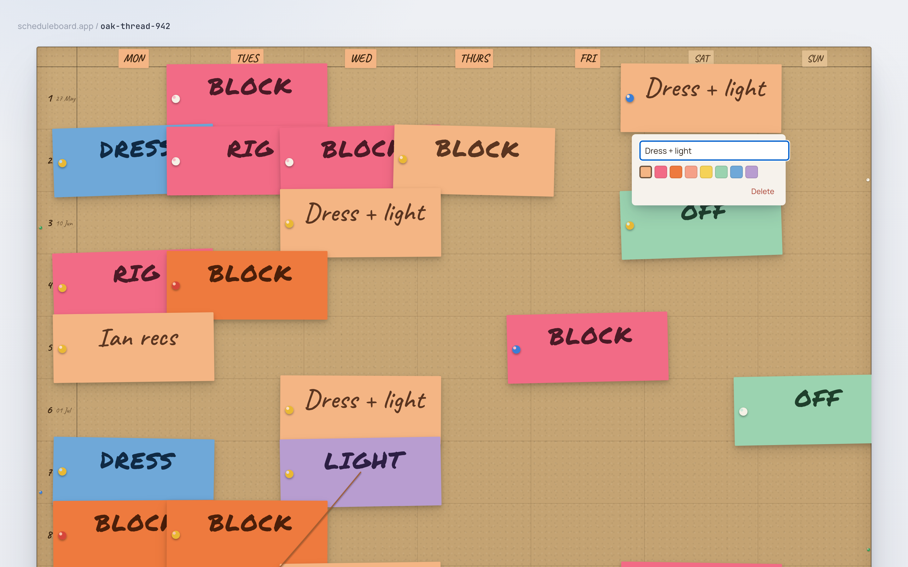
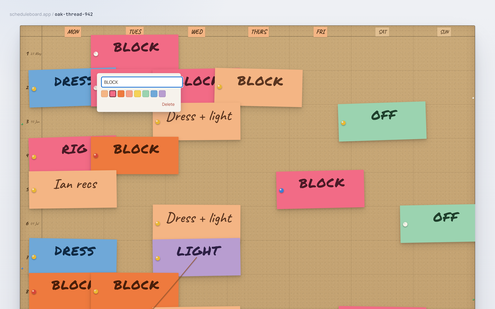

# Phase 3 Review — Cards: create, edit, recolor, delete

## Summary

Workflows 01 (add card) and 04 (edit / recolor / delete) now work end-to-end against a `LocalStorageRepository` that actually persists. Empty-cell clicks land an optimistic card on the cork and dock the `EditPopover` beneath it; typing renders live (with the marker-font auto-switch); Enter / blur commits; Esc on a newly-created card removes it with no write; clicking an existing card opens the popover with text + colour pre-filled; the eight palette swatches recolor live; the Delete button removes the card and any thread that referenced it (invariant 9). Every persisted mutation flows through `useBoardEditor`, debounced to 250 ms (exactly — pinned with fake timers). The Card schema gained `createdAt` / `updatedAt`, fed by an injected `Clock`; the domain stays pure (ESLint now bans `Date.now()` / `new Date()` under `src/domain/`, and components can no longer touch `localStorage` directly). 152 unit + integration tests pass, 19 e2e specs pass across chromium / firefox / webkit (visual baseline correctly skipped on firefox / webkit).

## What shipped

- **Domain — Card timestamps + Clock injection.** [src/domain/types.ts](../src/domain/types.ts) gains `Card.createdAt` and `Card.updatedAt`; [src/domain/clock.ts](../src/domain/clock.ts) adds the `Clock = () => number` type and a deterministic `defaultClock = () => 0`. `addCard` stamps both on create, `updateCard` and `moveCard` bump `updatedAt` on every patch. Same pattern as the existing `Rng` injection — production code passes `() => Date.now()` from [src/App.tsx](../src/App.tsx); the domain layer never calls `Date.now()` itself.
- **ESLint — domain purity + component / storage boundary.** [eslint.config.js](../eslint.config.js) adds two rules:
  - Under `src/domain/**`: `no-restricted-syntax` blocking `Date.now()` and `new Date()`. The compatible escape hatch is the injected clock.
  - Under `src/ui/**`, `src/state/**`, `src/App.tsx`: `no-restricted-globals` for `localStorage` / `sessionStorage`. Components must go through `BoardRepository`.
- **Persistence — `save()` + real `LocalStorageRepository`.** [src/persistence/repository.ts](../src/persistence/repository.ts) extends `BoardRepository` with `save(slug, board)`. [src/persistence/localStorage.ts](../src/persistence/localStorage.ts) now JSON-encodes each board under `sb:board:<slug>`, with defensive fallbacks: missing key → freshly-seeded demo; corrupt JSON → demo; storage thrown (private mode, quota) → drop the write silently. The slug-scoping is enforced by tests, so saving to one slug never pollutes another. [src/persistence/memory.ts](../src/persistence/memory.ts) implements `save()` for tests.
- **State — `useBoardEditor` hook.** [src/state/useBoardEditor.ts](../src/state/useBoardEditor.ts) owns `board`, `editor`, and the debounced repository write. Editor is a discriminated union (`idle` or `editing { cardId, isNew, original }`); `original` is the snapshot used to revert Esc on an existing edit. `beginNew(week, day)` adds the optimistic card + schedules the save; `cancelEdit` for `isNew` cancels the pending save AND removes the card so the repo never sees the transient. The hook flushes any pending save on unmount so a user's last keystroke doesn't get dropped. Debounce window: `DEFAULT_DEBOUNCE_MS = 250`, exact.
- **UI — `<EditPopover />`.** [src/ui/EditPopover.tsx](../src/ui/EditPopover.tsx) — autoFocused text input with `Enter` (commit) / `Escape` (cancel) / blur (commit) handlers; 8 colour swatches in palette order with `aria-pressed` reflecting the active colour; Delete button. Swatch and Delete buttons `preventDefault` on `mousedown` so the input doesn't blur-commit ahead of the click.
- **UI — `<Board />` click overlay + popover slot.** [src/ui/Board.tsx](../src/ui/Board.tsx) lays a transparent per-cell click overlay (`cell-{week}-{day}`) under the cards. Empty-cell clicks fire `onCellClick(week, day)`; card-slot clicks (later in DOM, so above the overlay visually) `stopPropagation` and fire `onCardClick(cardId)`. Decorative pin holes gained `pointerEvents: none` so they can't intercept clicks. The popover, when provided via the `popover` + `popoverForCard` props, is positioned beneath the editing card with a 4 px clamp so it never extends past the cork edge.
- **UI — `cellCenter` + `cellAt` lifted to tokens.** [src/ui/tokens.ts](../src/ui/tokens.ts) now exports both; Phase 4's drag will reach for `cellAt(x, y, metrics, weeks)` to map continuous drop coordinates back to `{ week, day }`. Phase 3 itself routes clicks via per-cell DOM hit targets and doesn't need it yet, but the math is in one place.
- **App composition.** [src/App.tsx](../src/App.tsx) now accepts optional `{ repository, slug, clock, debounceMs }` props so integration tests can drive a deterministic `InMemoryRepository` + fake clock. Production-mode defaults are unchanged: real `LocalStorageRepository`, the `oak-thread-942` demo slug, and a `Date.now()`-backed clock injected at the boundary.

### Card-popover visual

| New card — typing live (text + marker-font auto-switch render in real-time) | Existing card — popover opens with text + swatch pre-filled |
| --- | --- |
|  |  |

Both screenshots are produced by [scripts/grab-shots-phase-3.mjs](../scripts/grab-shots-phase-3.mjs), the same one-shot pattern as Phase 2 (`scripts/grab-shots-B.mjs`).

## Tests added

| Level | Count | Files |
| --- | --- | --- |
| Unit | 7 (domain) + 12 (persistence) | [tests/unit/domain/board.timestamps.test.ts](../tests/unit/domain/board.timestamps.test.ts) covers TDD steps 1–3 (addCard / updateCard / moveCard stamps + bumps + same-cell no-op invariance + deleteCard requires no clock). [tests/unit/persistence/repository.test.ts](../tests/unit/persistence/repository.test.ts) gained `save()` round-trip, slug-scoped key, slug isolation, demo fallback on cache miss + corrupt JSON. |
| Integration (RTL) | 12 | [tests/integration/cards.test.tsx](../tests/integration/cards.test.tsx) — one assertion block per BUILD_PLAN Phase 3 TDD step 4 through 13, plus an explicit fake-timer "debounce is exactly 250 ms" test. Renders the full `<App />` against an `InMemoryRepository` with a fixed clock and a `vi.spyOn(repo, 'save')` to count writes. |
| E2E (Playwright) | 3 specs × 3 browsers = 9 runs (+ baseline visual skips) | [tests/e2e/cards.spec.ts](../tests/e2e/cards.spec.ts) — workflow 01 (add → reload still there), workflow 04 (recolor coral → reload still coral), and a workflow 04 delete variant (delete → reload still gone) covering invariant 9. Each clears localStorage in `beforeEach` so the demo fallback re-seeds cleanly. Spec cards use unique text (`E2E spec — add`, etc.) so they never collide with the demo's existing `Dress + light` / `Symphony Holiday` strings. |

**152 unit + integration tests pass in ~3.4 s.** Domain coverage on the head commit:

```
File       | % Stmts | % Branch | % Funcs | % Lines
-----------|---------|----------|---------|--------
All files  |   97.43 |    96.47 |  100.00 |   97.16
 board.ts  |   97.64 |    97.26 |  100.00 |   97.46
 random.ts |   85.71 |    75.00 |  100.00 |   85.71
```

Domain ≥ 90 / 90 gate satisfied (`97.43 / 96.47`).

## Design adherence

The new editor flows track CLAUDE.md §8 (workflows 01 and 04) and §5 (invariants). Specifically:

- **Tactile, not slick.** The popover uses the existing `SURFACE.paper`, the cool drop shadow, and a 6 px radius so it reads as a small physical note slipping out from under the card. No icon library, no calendar-app chrome, no skeumorphic toolbar.
- **No new dependencies.** Vanilla React + fireEvent suffice (no `user-event`, no Zustand, no Immer). The plan-then-install gate is satisfied by zero installs.
- **Default new card is peach.** Asserted in the step-4 integration test (`rgb(244, 181, 132)`).
- **Marker font auto-applies live.** Step 8 explicitly switches from Caveat to Permanent Marker as the user types `block` → `BLOCK`.
- **Pin and rotation are stable per card.** Step 12 round-trips a card through edit + recolor and asserts the persisted `rotation` and `pin` are byte-identical to the originals (invariant 6).
- **Deleting a card removes its threads.** Step 11's thread variant pins this through the UI (invariant 9), in addition to the existing Phase 1 domain-level coverage.
- **Sat (day=5) and Sun (day=6) are first-class.** Step 13 drives one card into each weekend column through the same `cell-{week}-{day}` code path as weekdays.

### Where it diverges — and why

1. **`cellAt` lifted but unused in Phase 3 routing.** The kickoff prompt explicitly asked for `cellAt(x, y, metrics)` "alongside the existing `cellCenter()`". `cellCenter` was inlined in `Board.tsx`; both are now exported from `tokens.ts`. Phase 3 click-routing uses per-cell DOM hit targets (`cell-{w}-{d}` divs) — deterministic in jsdom, no event-coordinate arithmetic, no `getBoundingClientRect` reads. The `cellAt` math is there for Phase 4's drag-over case; documented as "Phase 4 will use it" in `tokens.ts`.
2. **`defaultClock = () => 0`, not `() => Date.now()`.** The Rng pattern lets `defaultRng = Math.random` for ergonomics. The kickoff prompt explicitly bans `Date.now()` in the domain — so the default is a deterministic zero clock. Test code that doesn't care about timestamps stays terse, and production code that forgets to inject a clock produces obviously-zero `createdAt` instead of silently calling the wall clock from inside the domain layer.
3. **Cancel-on-existing-edit reverts the card and persists the revert.** Phase 3's only test for Esc is for newly-created cards (step 7). The hook also implements the "revert if edited" case from CLAUDE.md §8 for existing cards, but doesn't pin it with a dedicated test — the user-visible contract Phase 3 owes is the new-card path. Phase 6 (undo/redo + keyboard shortcuts) is the right place to harden the revert path with a dedicated test.
4. **Card-overhang clipping still on.** The cork surface keeps `overflow: hidden` so the Phase 2 visual baseline doesn't shift. The popover lives inside the surface and is clamped to a 4 px inner margin so it never reaches the clip edge.

## Invariants pinned

| # | Invariant | New / refreshed assertion in Phase 3 |
| --- | --- | --- |
| 3 | No save button. Edits debounce 250 ms then persist. | `tests/integration/cards.test.tsx > step 6 — Enter commits, closes the popover, and the repository sees one save after the 250 ms debounce` (one write per commit) + `step 6 — the 250 ms debounce window is exact` (fake-timer boundary at 249 / 250 ms). |
| 5 | Marker font auto-applies via the all-caps regex; users opt out with lowercase. | `tests/integration/cards.test.tsx > step 8 — typing all-caps switches the rendered font to Permanent Marker` flips between `block` (Caveat) and `BLOCK` (Permanent Marker) live, reading `style.fontFamily` from the actual card DOM. |
| 6 | Pin colour + rotation are stable per card across edits. | `tests/integration/cards.test.tsx > step 12 — rotation and pin are unchanged after edit and recolor` reads the persisted save's `cards[0].rotation` / `.pin` and asserts they're byte-identical to the pre-edit card. |
| 7 | One Mon–Sun column set; Sat / Sun cells are first-class. | `tests/integration/cards.test.tsx > step 13` adds a card to (week 0, day 5) AND (week 0, day 6) through the same flow as weekdays; the e2e workflow-01 spec also opens via `cell-0-5` (Saturday). |
| 9 | Deleting a card removes its threads. | `tests/integration/cards.test.tsx > step 11 — Delete also drops any thread referencing the card` constructs a two-card board + one thread, deletes a card via the popover, asserts the persisted save has zero threads. Reinforces the Phase 1 domain-level pin with a UI-level one. |

## Defects discovered

- **`react-hooks/refs` v7 rule fires on `ref.current = X` at module top-level.** First-pass `useBoardEditor` mirrored `editor` / `board` into refs by direct assignment in the render body. The Husky pre-commit hook caught it (`Cannot update ref during render`). Fixed by moving the mirror into a single `useEffect()` that runs after every commit, plus per-handler assignments inside callbacks (which are post-commit anyway). No test regression.
- **Demo board fallback collides with E2E spec text.** First-pass e2e specs typed "Dress + light" and "Holiday" — both already exist in the demo (`Dress + light` × multiple, `Symphony Holiday`). Playwright strict mode then flagged ambiguous matches. Fixed with unique spec strings (`E2E spec — add`, `E2E spec — recolor`, `E2E spec — delete`). Cheaper than reaching into the app to expose an "empty board" test mode.
- **Fake-timer-from-start blocks RTL `waitFor`.** First-pass integration tests put `vi.useFakeTimers({ shouldAdvanceTime: false })` in `beforeEach`, and every `waitFor` for the initial board load timed out at 5 s because RTL polls via `setInterval`. Restructured so each test runs on real timers by default and opts into fake timers only for the exact-debounce assertion. Faster too (~2.4 s for 12 tests).

## Tech debt accrued

- **The `original` snapshot on `EditorState` is unused in Phase 3.** It's stored on `beginEdit` and read by `cancelEdit`'s revert-for-existing-card path, but no test pins that path. The shape will become load-bearing in Phase 6 when undo/redo lands; until then, it's belt-and-braces.
- **`useBoardEditor` flushes on unmount but doesn't rate-limit.** Holding Backspace on a 100-char card produces 100 mutations + 1 final save (correct). A keyboard user mashing arrow keys would produce 100 mutations + 1 save under Phase 6's keyboard shortcuts; per-keypress saves would be wasteful. Track via the Phase 6 keyboard plan, not here.
- **No `LocalStorageRepository` integration test for write-after-write under quota pressure.** Phase 3 catches the `quota exceeded` throw silently. Phase 7's real backend will surface failures explicitly via the network layer; that's the right place to introduce a UI "save failed" surface, not here.
- **No card-slot `cursor: pointer` ARIA hint.** The card slots get `cursor: pointer` when `onCardClick` is provided, but there's no `role="button"` / `aria-label`. Phase 8 (accessibility) is the right place to add proper roles + keyboard activation for the cards.
- **`scripts/grab-shots-phase-3.mjs` references `localhost:4173`.** Same approach as the Phase 2 review scripts — not wired into `npm scripts`, invoked once per review and discarded.

## Risks / unknowns for next phase

- **Drag will need the per-cell DOM overlay to be drag-aware**, not just clickable. Phase 4 can either reuse the existing `cell-{w}-{d}` divs (extending their handlers to `onDragOver` / `onDrop`) or layer a single `cellAt`-driven overlay on top. The math is now in `tokens.ts`; pick at Phase 4 kickoff.
- **Stacking offset on the data shape (Phase 4).** Phase 3 deliberately did not add `z` / `offset` to `Card` — those land with Phase 4's stacking. Any board persisted in Phase 3's localStorage will be missing those fields when Phase 4 reads them back, so Phase 4 must default-fill them on load.
- **The `Card` type is no longer additively forward-compatible.** With `createdAt` / `updatedAt` now required, a Phase 7 backend `PATCH` response that omits them would deserialize to an invalid `Card`. Phase 7 should mint defaults at the boundary (the server's clock at the time of the PATCH).
- **The demo board re-seeds on cache miss for any slug.** Phase 7's slug routing will replace this with "unknown slug → empty board"; for now, the first visit to `/b/anything` shows the same hero demo. Documented in `LocalStorageRepository`'s docstring.

## Quality gate status

Local, on the head commit `9d9d32e` of `phase-3-cards`:

- [x] Lint clean — `npm run lint` (exit 0)
- [x] Types clean — `npm run typecheck` (exit 0)
- [x] Unit + integration green — `npm test` (152 / 152 across 21 files in ~3.4 s)
- [x] E2E green — `npm run test:e2e` (19 passed, 2 visual baselines correctly skipped on firefox/webkit, ~8.5 s)
- [x] Production build succeeds — `npm run build` (`dist/`: 1.32 kB HTML / 0.32 kB CSS / 161.08 kB JS, 52.93 kB gzipped — up ~6 kB from Phase 2 for the editor hook + popover)
- [x] Coverage threshold met — domain ≥ 90 / 90 (97.43 / 96.47 / 100 / 97.16)
- [x] Debounce window pinned at exactly 250 ms with fake timers — `step 6 — the 250 ms debounce window is exact (quality gate)`
- [x] Components do not call `localStorage` directly — enforced by the new ESLint rule under `src/ui/**` / `src/state/**` / `src/App.tsx`; the rule is exercised by lint passing with the current code (where every write goes through `useBoardEditor` → `BoardRepository`)
- [ ] **CI green on the head commit** — will be verified by the PR after pushing; this checklist updates once CI reports.

## Recommendation

Proceed to Phase 4 (drag + stacking) once CI is verified green on the PR. The two pre-existing Phase 4 prerequisites are met: `cellAt(x, y, metrics, weeks)` lives in `tokens.ts`, and the per-cell overlay is in place to receive pointer events. The `Card` data shape will gain `z` / `offset` in Phase 4 per CLAUDE.md §10 change-log row 4 — defer the schema bump to that branch.

## Appendix

### Commits on this branch (off main)

1. `1706479` — `feat(domain): Card.createdAt + updatedAt with injected Clock`
2. `b09f941` — `feat(cards): workflows 01 + 04 — create, edit, recolor, delete with persistence`
3. `9d9d32e` — `test(e2e): workflows 01 + 04 across chromium / firefox / webkit`

### File changes (vs main)

```
 eslint.config.js                                              | + Date.now / new Date / localStorage guards
 reviews/phase-3.md                                            | +new
 reviews/phase-3-shots/                                        | +3 PNGs
 scripts/grab-shots-phase-3.mjs                                | +new (review-only helper)
 src/App.tsx                                                   | refactor — injected deps, wires useBoardEditor
 src/domain/board.ts                                           | +clock injection on addCard / updateCard / moveCard
 src/domain/clock.ts                                           | +new
 src/domain/index.ts                                           | +./clock barrel
 src/domain/types.ts                                           | Card +createdAt +updatedAt
 src/persistence/localStorage.ts                               | full rewrite (real persistence)
 src/persistence/memory.ts                                     | +save
 src/persistence/repository.ts                                 | interface +save
 src/state/useBoardEditor.ts                                   | +new
 src/ui/Board.tsx                                              | +onCellClick, +onCardClick, +popover slot, +cell overlay, pinholes pointer-events:none
 src/ui/EditPopover.tsx                                        | +new
 src/ui/tokens.ts                                              | +cellCenter (lifted) + cellAt (new) + Day import
 tests/e2e/cards.spec.ts                                       | +new (workflow 01 + 04)
 tests/integration/cards.test.tsx                              | +new (steps 4–13 + exact-debounce)
 tests/unit/domain/board.timestamps.test.ts                    | +new (steps 1–3)
 tests/unit/persistence/repository.test.ts                     | +6 save-related cases
```

### No new runtime dependencies

`package.json` is unchanged. No `npm install` was needed; the plan-then-install gate (CLAUDE.md user memory) is trivially satisfied.
